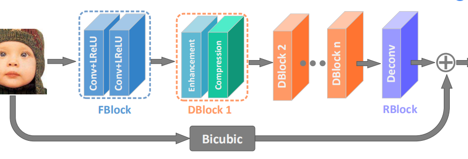
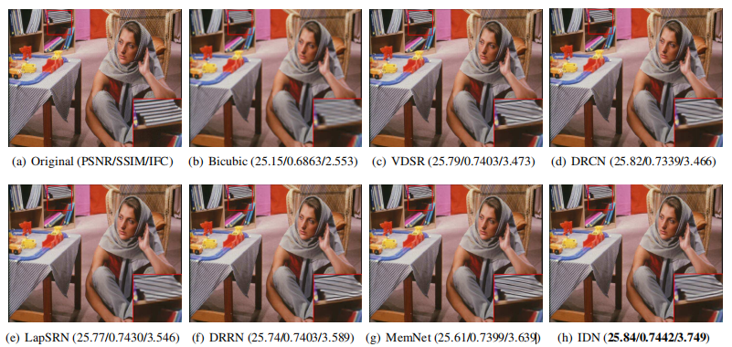

## Information Distillation Network 
- Torch impelment of CVPR2018 paper: 
[Fast and Accurate Single Image Super-Resolution via Information Distillation Network](https://arxiv.org/abs/1803.09454)
- [Offical caffe code](https://github.com/Zheng222/IDN-Caffe) available  
# Introduction
-  A CNN-based super-resolution network,achieving single image super-resolution.

      
    <em> The structure of IDN</em>

      
    <em> The architecture of enhancement unit in the proposed model. </em>

      
    <em> Example. </em>

