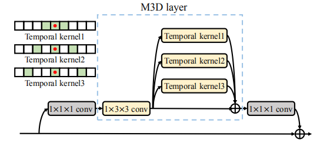
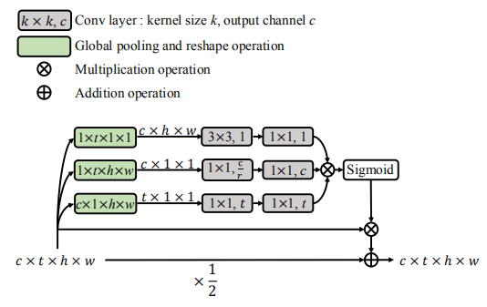
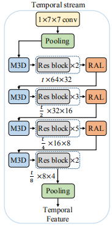

## M3D  
- Torch impelment of paper: 
[Multi-scale 3D Convolution Network for Video Based Person Re-Identification](https://arxiv.org/abs/1811.07468)
# Introduction
- The whole network in paper is a two-stream convolution network to extract spatial and temporal 
  cues for video based person ReID. 
- M3D layer is used in temporal stream which is capable of learning multi-scale temporal feature.The whole idea is inspired by dilation in 2d convolution,and it combines 3 kernel with different
  dilation in time dimension.

      
    <em> The structure of M3D layer</em>

  

- Residual Attention Layer(RAL):Temporal cues extracted on some consecutive frames could be more important or robust than the others. So RAL is introduced to compute attention weights for different frames.
It consists of three branches to apply spacial, temporal,and channel attentions. The ReLU and Batch Normalisation (BN) layer are applied after each convolution layer.

      
    <em> The structure of RAL layer</em>

  

      
    <em> The structure of spatial stream</em>

  
